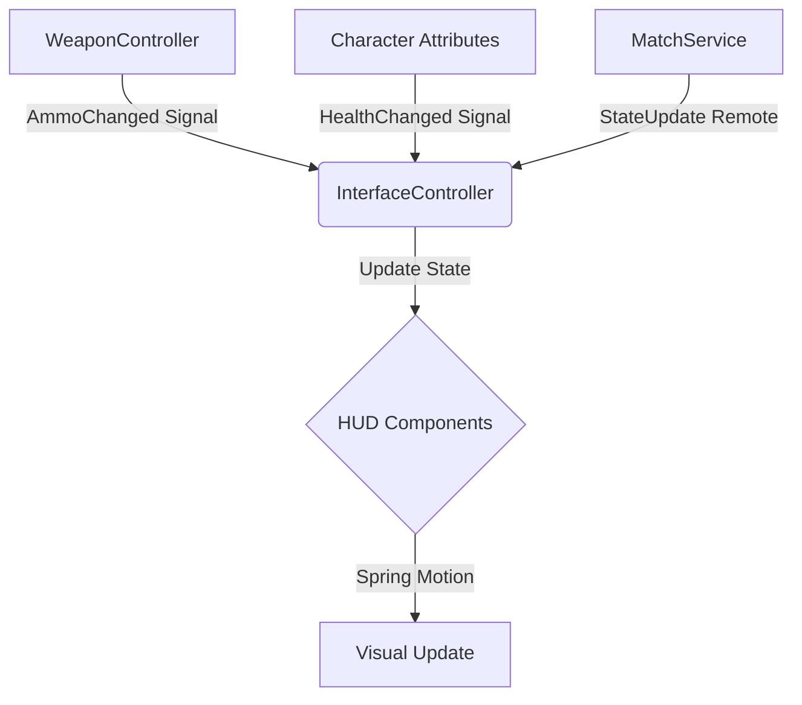

# Feature: Player HUD/GUI System

## 1. Overview
The **Player HUD (Heads-Up Display)** is the primary interface between the player and the game state. It is designed to be **non-diegetic yet grounded**, simulating a high-tech tactical overlay used by Tier 1 operators (MW 2019 aesthetic).

The system is **High-Fidelity**, **Modular**, and **Reactive**, driven by a strict separation of data (State) and visuals (View).

---

## 2. Architecture & Logic

### 2.1 The "Three-Layer" Rendering Pipeline
To manage Z-Index complexity and draw calls, the HUD is divided into three distinct rendering layers within a single `ScreenGui`:

| Layer | Z-Index | Components | Update Frequency | Logic |
|-------|---------|------------|------------------|-------|
| **World Layer** | 10 | Objective Markers, Pings, Nameplates | 60Hz (RenderStepped) | Projects 3D world coordinates to 2D screen space using `Camera:WorldToScreenPoint`. |
| **Static Layer** | 20 | Minimap, Ammo, Health, Squad List | Event-Based | Updates only when specific data changes (e.g., AmmoCount changed). |
| **Feedback Layer** | 100 | Hitmarkers, XP Feed, Kill Banners, Notifications | Event-Based + Spring Physics | High-priority overlays that sit on top of everything. |

### 2.2 Data Flow (Reactive Pattern)
The HUD does not poll data in a loop. It connects to signals exposed by Controllers.

### 2.3 Optimization Strategies
1.  **Mount/Unmount**: Heavy components (like the Scoreboard) are not just hidden; they are unmounted from the DataModel or use `Visible` on the top-level frame to prune the render tree.
2.  **Object Pooling**: Floating text (XP numbers) and Hitmarkers use an object pool to prevent instantiation spikes during combat.
3.  **Throttling**: The "Compass" and "Minimap" updates are throttled to run after physics simulation (`RunService.PostSimulation`) to prevent jitter.

---

## 3. Visual Design System

### 3.1 Typography
*   **Primary Data (Ammo, Score)**: `Gotham Black` - Maximum readability.
*   **Labels (Names, Objectives)**: `Gotham Medium` - Clean, unobtrusive.
*   **Fluff Text (Weapon Names)**: `Gotham` (Regular) - All caps, wide tracking.

### 3.2 Color Palette (Contextual)
*   **Friendly / Squad**: `Color3.fromRGB(85, 255, 127)` (Tactical Green) or `Color3.fromRGB(0, 162, 255)` (Alliance Blue).
*   **Enemy / Threat**: `Color3.fromRGB(255, 50, 50)` (Alert Red).
*   **Armor / Protection**: `Color3.fromRGB(0, 150, 255)` (Plate Blue).
*   **XP / Rewards**: `Color3.fromRGB(255, 215, 0)` (Gold).
*   **Critical Low**: Pulses between `White` and `Red`.

### 3.3 Safe Zones & Anchors
All UI elements adhere to a **10% Safe Zone** margin to ensure visibility on all aspect ratios (4:3 to Ultrawide).
*   **Minimap**: Top-Left Anchor `(0, 10, 0, 10)` offset.
*   **Ammo**: Bottom-Right Anchor `(1, -10, 1, -10)` offset.

---

## 4. Component Deep Dive

### 4.1 Tactical Minimap
*   **Shape**: Toggleable Square/Circle (Settings).
*   **Logic**:
    *   **Rotation**: Rotates based on `Camera.CFrame.LookVector` (yaw only).
    *   **Zoom**: Contextual. 
        *   On Foot: 250 studs radius.
        *   In Vehicle: 500 studs radius.
    *   **Masking**: Uses `ImageLabel` with a masking texture to clip map tiles.
*   **Indicators**:
    *   **Player**: Yellow arrow in center.
    *   **Enemies**: Red dots. Only appear if shooting (unsilenced) or UAV active.
    *   **Pings**: Pulse animation at coordinates.

### 4.2 Combat Feedback (The "Feel")
*   **Hitmarkers**:
    *   **Visual**: 45-degree cross lines.
    *   **Logic**: 
        *   Standard Hit: White, small scale punch (1.2x).
        *   Headshot: Red, double lines, large scale punch (1.5x).
        *   Armor Crack: Blue, glass shatter sound.
    *   **Audio**: Pitch-shifted "thwack" sound (Higher pitch for headshots).
*   **XP Feed**:
    *   **Logic**: Stack-based queue. New events push old ones up.
    *   **Math**: Sums identical events (e.g., "Kill" + "Headshot" + "Longshot" = Single total block).

### 4.3 Weapon & Status
*   **Ammo Counter**:
    *   **Design**: Large numbering. 
    *   **Mag Check**: When ammo < 20%, the text turns Red and vibrates using a Sine wave spring.
*   **Health Overlay**:
    *   **Vignette**: Darkens screen edges as health drops.
    *   **Blood**: Image overlays fade in at < 50% health.
    *   **Heartbeat**: Haptic feedback (Controller vibration) matches low-health pulse.

### 4.4 Compass (Top Bar)
*   **Implementation**: A `ScrollingFrame` containing a repeating tape texture.
*   **Math**: `XOffset = (CameraYaw / 360) * TapeWidth`.
*   **Features**: Shows Red Diamonds for enemy fire directions (mapped from World to Compass degrees).

---

## 5. Animation & Motion Physics

The HUD uses a **Spring Physics** model (e.g., Flipper/Sprinkles) rather than linear Tweens for a responsive, organic feel.

### 5.1 Spring Configuration
| Element | Damping (Friction) | Frequency (Speed) | Trigger |
|---------|--------------------|-------------------|---------|
| **Hitmarker** | 0.6 | 4.5 | On Hit (Punch scale 1.0 -> 1.5 -> 1.0) |
| **Ammo Count** | 0.8 | 3.0 | On Fire (Y-Offset kick down) |
| **Score Popup** | 0.7 | 2.5 | On Kill (Slide in from right) |
| **Button Hover** | 0.9 | 5.0 | Mouse Enter (Scale 1.0 -> 1.05) |

### 5.2 Transitions
*   **Enter**: Elements usually "Slide and Fade" (Offset + Transparency).
*   **Exit**: Fast fade out.

---

## 6. Gamemode Adaptation

The HUD re-layouts dynamically based on the `MatchService.Gamemode` state.

### 🏢 Multiplayer (Arena)
*   **Top-Center**: Scoreboard (Team A vs Team B).
*   **Bottom-Left**: Killstreak Meter (Circular progress bars).
*   **Minimap**: Always shows bounds of the arena.

### 🚁 Battle Royale (Warzone)
*   **Top-Center**: Gas Phase Timer & Circle Status.
*   **Top-Right**: Squad Alive Count / Total Enemies.
*   **Bottom-Left**: Squad Health Bars (List layout).
*   **Inventory**: Armor Plate count (Satchel icon).

---

## 7. Development Roadmap

### Phase 1: Core Framework (Completed)
- [x] `InterfaceController` Setup.
- [x] Basic ScreenGui & Scaling Logic.
- [x] Weapon/Ammo Data binding.

### Phase 2: Combat Feel (In Progress)
- [ ] Hitmarker System with Audio.
- [ ] XP Feed Stacking Logic.
- [ ] Directional Damage Indicators (2D Vectors).

### Phase 3: Advanced Systems (Pending)
- [ ] Minimap ViewportFrame vs Image Rendering.
- [ ] Compass Tape Math.
- [ ] Settings Menu Integration (HUD Scale, Colorblind Mode).

---

**Related Documentation:**
- [UX Design & Wireframes](../../Design/Design_HUD.md)
- [Technical Component Specs](../../Components/Component_HUD.md)